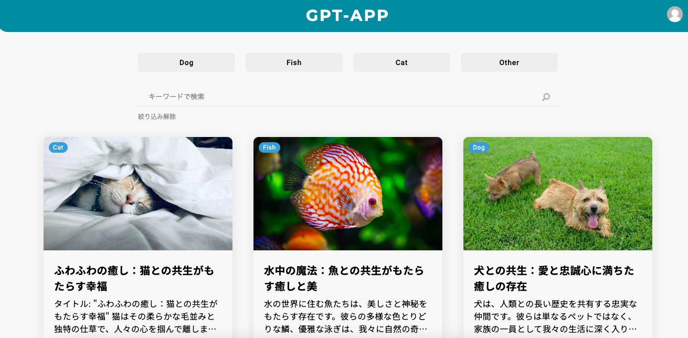
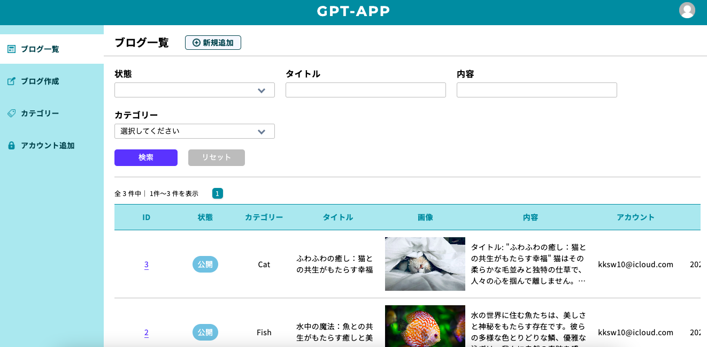
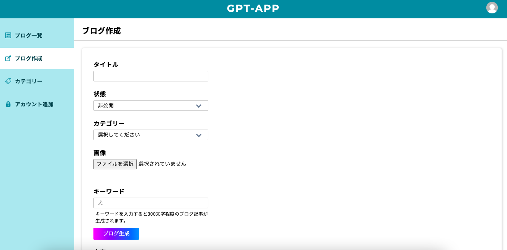

# GPT-APP

トップページ 
<a href="https://k-gpt-app.vercel.app" target="_blank">https://k-gpt-app.vercel.app</a> 
 
ログイン画面 
<a href="https://k-gpt-app.vercel.app/admin/login" target="_blank">https://k-gpt-app.vercel.app/admin/login</a>

ID: test@example.com 
pass: password

OpenAIのAPIを活用したブログ記事生成アプリケーションです。 
記事のライティングに時間をかけたくない方に向けて、ブログ記事の自動生成の機能を提供することを提案する為のサンプルのアプリケーションとして作成しました。 
ユーザビリティを重視し、複数のユーザーが利用できるようにアカウント認証とアカウント追加機能を備えることで記事の投稿者を識別できます。 
新しいブログ記事を作成する際、記事生成後にはプレビューを確認できるように工夫しました。一覧画面では、記事の絞り込みや公開/非公開の切り替えなど、ブログアプリケーションに必要な機能を実装しました。  

## 利用している技術

<ul>
<li>Nuxt.js 3</li>
<li>TypeScript</li>
<li>Sass</li>
<li>Prisma</li>
<li>Firebase</li>
<li>openAI API</li>
<li>Vercel</li>
<li>planetscale</li>
</ul>

## DEMO

